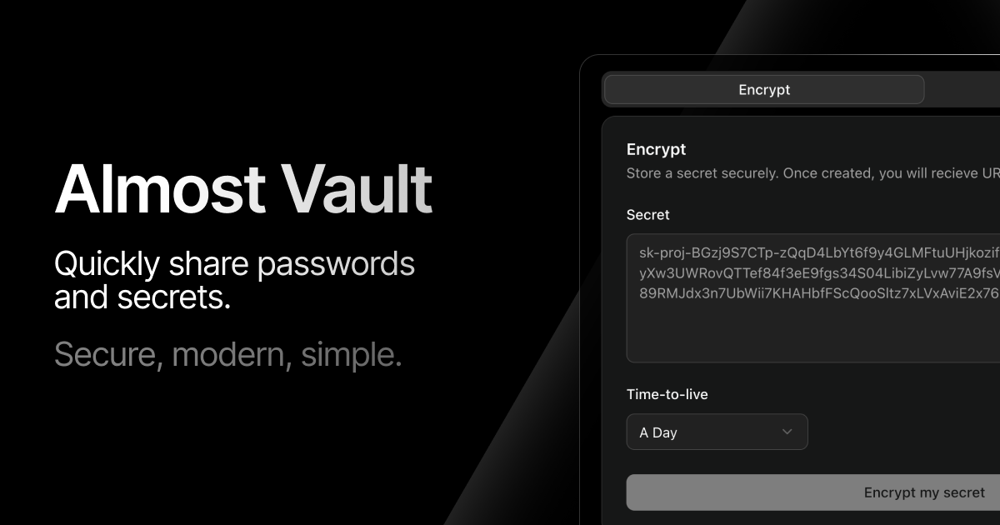

<p align="center">
  
</p>

<p align="center">
  <a href="https://github.com/Meldiron/almost-vault/actions/workflows/api.yml">
    
  </a>
  <a href="https://github.com/Meldiron/almost-vault/actions/workflows/site.yml">
    
  </a>
</p>

# Almost Vault

A secure, ephemeral secret-sharing application built with Appwrite. Share sensitive information with confidence using time-limited, read-restricted encrypted secrets.

## 🔒 Features

- **End-to-End Encryption**: Secrets are encrypted before storage and decrypted only when accessed
- **Time-to-Live (TTL)**: Secrets automatically expire after a specified duration
- **Read Limits**: Control how many times a secret can be accessed before being destroyed
- **Zero-Knowledge**: Secrets are permanently deleted after expiration or read limit
- **Shareable URLs**: Generate secure links to share secrets safely
- **No Registration Required**: Use the service without creating an account

## 🚀 Quick Start

### Using the Application

1. **Encrypt a Secret**:
   - Visit the application
   - Enter your secret message
   - Set the time-to-live (hour, day, week, month, or year)
   - Set the maximum number of reads (1-1000)
   - Click "Encrypt" to generate a secure ID or shareable URL

2. **Decrypt a Secret**:
   - Use the secret ID or visit the shareable URL
   - The secret will be displayed once and then permanently deleted

### Development Setup

#### Prerequisites

- Node.js 22+
- npm

#### Installation

1. Clone the repository:
```bash
git clone <repository-url>
cd almost-vault
```

2. Install dependencies:
```bash
# Install function dependencies
cd function
npm install

# Install site dependencies
cd site
npm install
```

3. Start development servers:
```bash
# Start the function (API)
cd function
CI=true node src/http.js

# Start the web application
cd site
npm run dev
```

## 🏗️ Architecture

Almost Vault consists of two main components:

### Frontend (`/site`)
- **Framework**: Vanilla JavaScript with Vite
- **UI Library**: Alpine.js with Tailwind CSS
- **Features**: Responsive design, real-time feedback, clipboard integration

### Backend (`/function`)
- **Runtime**: Node.js 22
- **Framework**: Koa.js with routing
- **Database**: Appwrite Database with encryption
- **API**: RESTful endpoints for secret management

## 🚢 Deployment

Almost Vault is designed to be deployed on Appwrite Cloud:

1. Deploy using the Appwrite CLI:
```bash
appwrite push site
appwrite push function
```

The application will be available at your configured Appwrite endpoint.

## 🔐 Security

- Secrets are encrypted at rest using Appwrite's built-in encryption
- No secrets are logged or stored in plain text
- Automatic cleanup ensures secrets don't persist beyond their intended lifetime
- CORS protection limits API access to authorized domains

## 🤝 Contributing

We welcome contributions! Please see [CONTRIBUTING.md](CONTRIBUTING.md) for guidelines.

## 📜 Code of Conduct

This project adheres to a [Code of Conduct](CODE_OF_CONDUCT.md). By participating, you are expected to uphold this code.

## 📄 License

This project is open source and available under the [MIT License](LICENSE).

## 🆘 Support

- **Documentation**: Check the [Appwrite Documentation](https://appwrite.io/docs)
- **Community**: Join the [Appwrite Discord](https://appwrite.io/discord)
- **Issues**: Report bugs or feature requests in the project's issue tracker

---

Built with ❤️ using [Appwrite](https://appwrite.io)